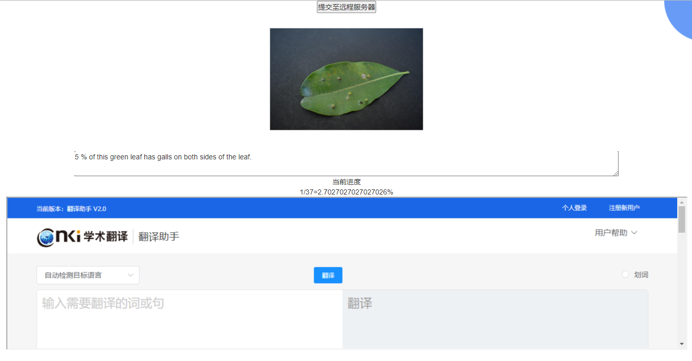

# 数据标注平台使用说明

### 代码已开源

代码仓库地址  
https://github.com/kej-shas/data-annotations

## 环境配置

首先你需要安装Python  
然后安装Python包

```shell
pip install tornado
pip install natsort
```

创建result文件夹，存储本地数据备份

## 数据集地址修改

```python
define("port", default=8888, help="运行端口", type=int)
define("root_path", default="{file_path}/{times}/{group}/", help="运行端口", type=str)
```

你需要将上面的```{file_path}/{times}/{group}/```改为你的具体路径,比如：

```python
define("root_path", default="E:/plant/pdata/1/2", help="运行端口", type=str)
# 其中/1/2表示第一次数据表组第2组
```

当然你也可以简化路径写成{times}/{group}/

```python
define("root_path", default="1/2/", help="运行端口", type=str)
# 其中/1/2表示第一次数据表组第2组
```

<span style="color: red; "> 注意：这里的路径分割符必须为<span style="color: black">"/"</span>或者<span style="color: black">"\\"</span> </span>

## 打开网站

在浏览器中打开  
http://localhost:8888/index.html  
网站截图


## 使用

### 数据标注

在下方知网翻译中进行翻译复制到上方的输入框中，使用```↓```和```→```即可翻页到下一张图片，使用```↑```和```←```
即可翻页到上一张图片  
<span style="color: red; ">注意：当进度下的数字发送变化时才进行编辑，避免数据发送异常</span>

### 数据同步

标注完数据后，可以点击提交至远程服务器，数据将会发生至远程服务器，远程服务器会根据本地浏览器生成的UUID，同一个浏览器会生成同一个UUID进行提交，避免数据发生重复，请勿在本地使用多个浏览器提交数据。

## 只允许本地使用同一个浏览器进行提交
